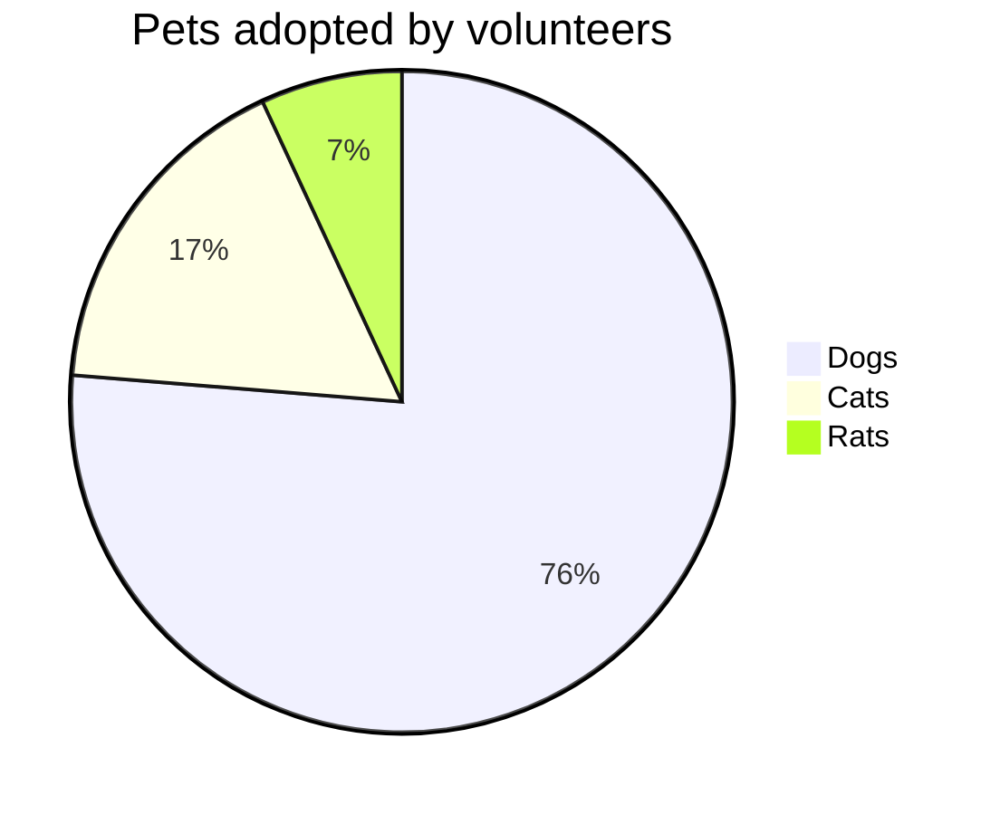

To quickly create graphs and charts, I use a tool called Mermaid on website: <https://mermaid.live/>

It can be directly used in markdown files like:

Sources: 
 * <https://github.blog/2022-02-14-include-diagrams-markdown-files-mermaid/>